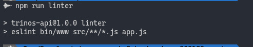
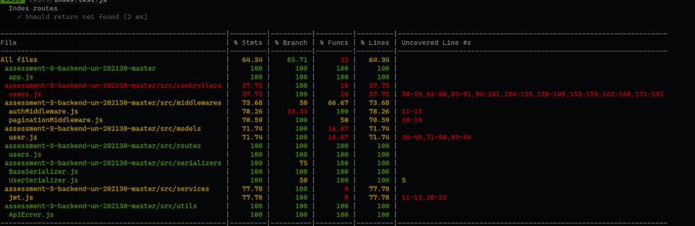

# Trinos API

## Setup
```
npm install
```

## Run tests
```bash
npm run test
```

## Run linter
```bash
npm run linter
```
## Integrantes
```bash
Manuel Rodríguez - 200111418
Juan Pablo Useche - 200117107
Rafael Velandia - 200104296
```

## Screenshot Linter


## Screenshot test



